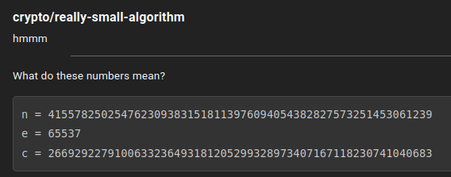
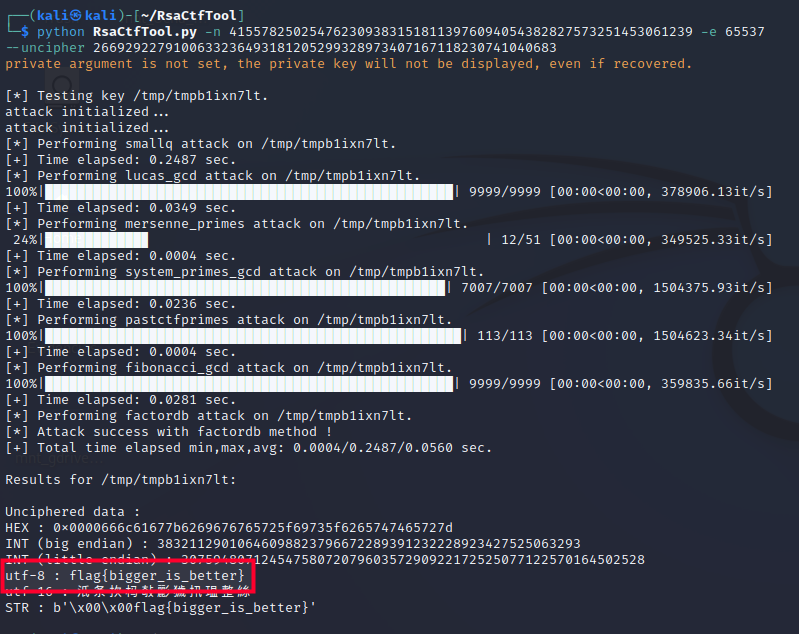

# Enunciado




# Resolución

Se trata de un reto de cifrado RSA, uno de los sistemas de cifrado de clave pública más utilizados. Los números que se proporcionan son los siguientes:

- `n` es el producto de dos números primos (p y q).
- `e` es el exponente público.
- `c` es el texto cifrado.

Para descifrar el texto cifrado `c`, se necesita la clave privada, que no se proporciona.

La clave privada en RSA se calcula a partir de los números primos `p` y `q` que se usaron para calcular `n`. Sin embargo, dado que no se proporcionan `p` y `q`, no se puede calcular la clave privada directamente y se necesita factorizar `n` para obtener `p` y `q`, lo que es un problema difícil en computación y no es factible para números grandes en un tiempo razonable.

Sin embargo, si `n` es lo suficientemente pequeño, se puede factorizar utilizando varios algoritmos disponibles en bibliotecas de código o en diferentes herramientas software.

Una vez que se tiene `p` y `q`, se puede calcular la clave privada `d` con la ecuación `(d * e) % ((p - 1) * (q - 1)) = 1`. Luego, se puede descifrar `c` con la ecuación `c^d % n`.

En resumen, se necesitan realizar los siguientes pasos:

1. Factorizar `n` en `p` y `q`.
2. Calcular `d` a partir de `e`, `p` y `q`.
3. Descifrar `c` utilizando `d` y `n`.

Para realizarlo, se puede usar una biblioteca de Python que tenga funciones de factorización y cifrado RSA ya implementadas, como `Crypto.PublicKey.RSA` de la biblioteca `pycryptodome`.

Otra forma que se puede intentar es utilizar un [ataque de Wiener](https://hmong.es/wiki/Wiener%27s_Attack). El ataque de Wiener es un método para romper RSA cuando la clave privada es pequeña en comparación con la clave pública. Básicamente, si d < 1/3 * n^(1/4) entonces es posible recuperar la clave privada (d).

Una herramienta que se puede utilizar es Rsactftool de Ganapati en GitHub. Esta herramienta tiene implementado el ataque a Wiener y es capaz de aplicarlo cuando es posible. 

Para utilizarla, se debe tener instalado Python y después instalar la herramienta utilizando git y pip:


```
git clone https://github.com/Ganapati/RsaCtfTool.git
cd RsaCtfTool
python3 -m venv venv
source venv/bin/activate
pip install -r "requirements.txt"
```

Una vez hecho esto, se puede usar Rsactftool para intentar descifrar el mensaje de la siguiente forma:

```
python RsaCtfTool.py -n 4155782502547623093831518113976094054382827573251453061239 -e 65537 --uncipher 2669292279100633236493181205299328973407167118230741040683
```




**Autor:** [Andr3sdelRio](https://twitter.com/Andr3sdelRio) 
 
