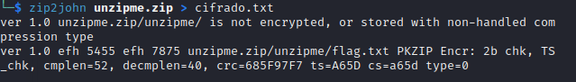
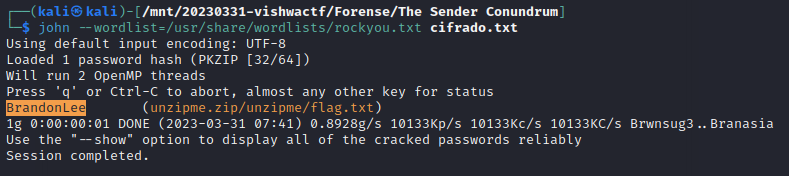
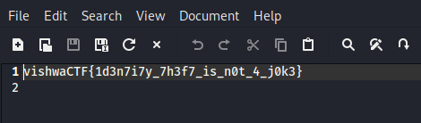

# Enunciado
*Marcus Got a Mysterious mail promising a flag if he could crack the password to the file.*

**Traducción:** "Marcus recibió un misterioso correo prometiendo una bandera si podía descifrar la contraseña del archivo."

# Resolución

Se nos proporciona un correo (en formato .eml) y un fichero zip cifrado.
Tras un primer análisis del correo no parece haber nada extraño ni de donde tirar, salvo un acertijo en el texto del mensaje, pero demasiado genérico.

Probamos directamente a tratar de descifrar la contraseña del zip con *John The Ripper*. Primero extraemos del fichero el contenido relevante para pasárselo en el formato correcto a *John The Ripper*. Esto lo hacemos con zip2john y volcamos el contenido a un fichero de texto:

Finalmente le pasamos el fichero a *John The Ripper* utilizando el diccionario rockyou y efectivamente obtenemos la contraseña:

La utilizamos para descifrar el zip y abrimos el fichero que contiene:

 
**Autor:** [Andr3sdelRio](https://twitter.com/Andr3sdelRio) 
