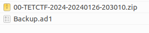

# Enunciado

- Fichero: https://drive.google.com/file/d/1k3GdAxgckGB9k1nKKn8Zz7wyEb3JT1lP/view?usp=sharing

# Resolución

Al descomprimir el fichero proporcionado obtenemos dos archivos:

El primero es un volcado de memoria RAM que no va a ser necesario para la resolución del reto. 
El segundo tiene extensión `.adb1`, que es el formato utilizado por AccessData Forensic Toolkit (FTK) para crear imágenes forenses de discos, por lo que trataremos de acceder a él mediante la herramienta FTK Imager. Al hacerlo obtenemos lo que parece ser un volcado del directorio `Àppdata` del usuario `Stirring`:

![Pasted image 20240128162439.png]

Haciendo *Botón derecho -> Export Files* hacemos una copia en disco de todos los ficheros y directorios. Al hacerlo, nos salta una advertencia de *Windows Defender* sobre un fichero ubicado en `Roaming\Microsoft\Templates\Normal.dotm`.
Al acceder a dicho fichero y mirar las macros que tiene, obtenemos la primera parte de la Flag, que era la dirección IP y Puerto del C2 (Command & Control):

![Pasted image 20240128162845.png]

Y al final de todo del fichero con la macro encontramos la siguiente cadena en Base64:

![Pasted image 20240128163004.png]

Al llevarla a [Cyberchef](https://github.com/UchaCTF/Herramientas_CTFs/blob/main/Readme.md#criptograf%C3%ADa) y ejecutar varias veces el decodificado de Base64, obtenemos la primera Flag:

![Pasted image 20240128163221.png]

Al ver el resto de ficheros disponibles en `AppData` observamos que hay varios ficheros que almacenan la navegación web realizada por el usuario, por lo que usamos la herramienta [BrowsingHistoryView] de Nirsoft para extraer la información y obtenemos el texto de la segunda Flag:

![Pasted image 20240128163520.png]

Poniendo todo conjunto:

**TetCTF{172.20.25.15:4444_VBA-M4cR0_R3c0v3rry_34sy_R1ght?}**
 
**Autor:** [Andr3sdelRio](https://twitter.com/Andr3sdelRio) 

- [URL original del reto](https://ctf.hackemall.live/challenges#TET%20&%204N6-20). *Disclaimer:Probablemente offline después de finalizar la competición* 
