# SanClemente-ForenseWindows
    
   Analisis forense de un equipo windows

### Caso #2

  
  
## Parte 1

El ex-piloto de carreras John Tanner es ahora un policía infiltrado en la Mafia de Nueva York. Su capo, el señor Castaldi, planea un golpe de forma inminente. Suponemos que el elegido para llevarlo a cabo es el implacable asesino a sueldo Jean Paul, alias “El Francés”, y que, como de costumbre, Tanner conducirá el coche de la huida. Sin embargo, aún no sabemos cuál es el objetivo.

Lo que sí sabemos es que Tanner estuvo manteniendo conversaciones con el Sr. Castaldi a través de una aplicación de chat. Por desgracia, dicha aplicación está cifrada con un mecanismo conocido como Double Ratchet, similar al que usan WhatsApp y sus competidores y, por tanto, no hemos podido intervenir dichas comunicaciones.

Ahora, Tanner está desaparecido y su ordenador está frito, lo cual no es de extrañar, pues medio FBI y parte de la policía metropolitana están sobornados. Por suerte, poco antes del golpe, uno de nuestros técnicos pasó a Tanner un USB con un programa para ejecutar. Dicho programa, llamado DumpIt, sirve para recoger una imagen de memoria del equipo. Cuando nuestros hombres llegaron, el USB estaba en el escondrijo acordado, así que quizás los agentes corruptos del FBI no lo hayan tocado. Como era de esperar, allí había una imagen de memoria con lo último que Tanner ejecutó en el ordenador antes de salir. Además, como habíamos quedado, en la recepción del hotel de enfrente de su apartamento nos dejó una nota en la cual estaba escrito el código hash de la imagen creada: a518111a8f288d94fb4fb0069e36a884e1483f72b51b876303b6c7cfcb945715

## Parte 2

Finalmente unos expertos en hardware han logrado rescatar una imagen del disco de Tanner. Con la nueva información adquirida, podemos sacar algunos datos más de su actividad en los últimos días. Los hashes del archivo son los siguientes:

MD5: 8712a3760e8fc801425309852ee1127a ExamenForense.img

SHA-1: eaa88659a5dd2453527ffee0ccb13447c7223184 ExamenForense.img

SHA-256: e4216bb636648b7a4188aacef3587c64aabfb05aade76b6070b3ce8d66d4568a ExamenForense.img

Evidencias aportadas:

Captura de memoria RAM (DRIVERGAME-20220212-133941.dmp - 2GB).
Imagen disco duro (ExamenForense.img.zip - 7.1GB --> descomprimido 32,0 GB)

# Solución

## 1.1 ¿Cuál es el nombre del equipo?
    
   ``Drivergame``
   
  Abriendo la imagen con autopsy podemos ver en Operating System Information el nombre del equipo.

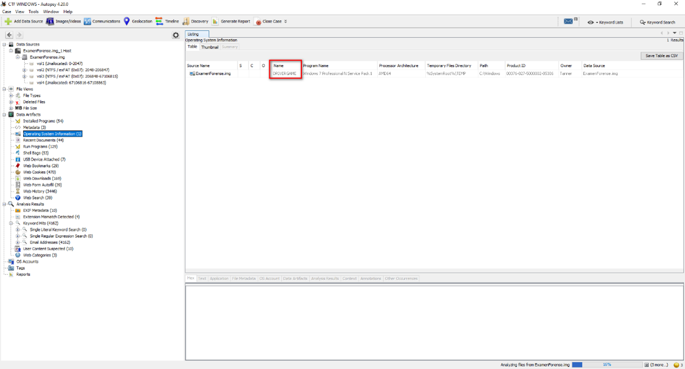

## 1.2 ¿Cuál es el hash de la contraseña del usuario Tanner?

   ``3ec585243c919f4217175e1918e07780``
    
   Nos vamos a la ram con volatility y con el comando
   
   ``python2.7 vol.py -f /home/beto/Downloads/DRIVERGAME-20220212-133941.dmp --profile=Win7SP1x64 hashdump`` 
   
   sacamos el hash del usuario Tanner
   
   
   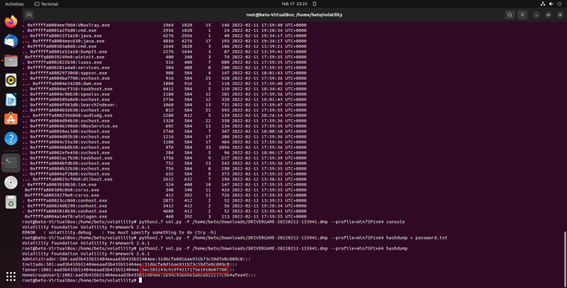
   
   
## 1.3 ¿Cuál es la contraseña correspondiente a dicho hash?

  ``abc123.``
  
  Pasamos el hash de nuestro usuario por el crackstation...
  
   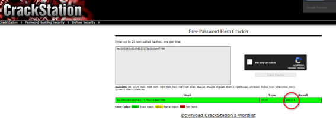

## 1.4 ¿Según el plugin consoles, ¿en qué dirección de memoria se encuentra la frase en la que Tanner pregunta a quién van a asesinar?

   ``0x192050``
   
   Usamos el comando consoles de volatility y vemos haciendo scroll la pregunta que hace Tanner
   
   ``python2.7 vol.py -f /home/beto/Downloads/DRIVERGAME-20220212-133941.dmp --profile=Win7SP1x64 consoles``
   
   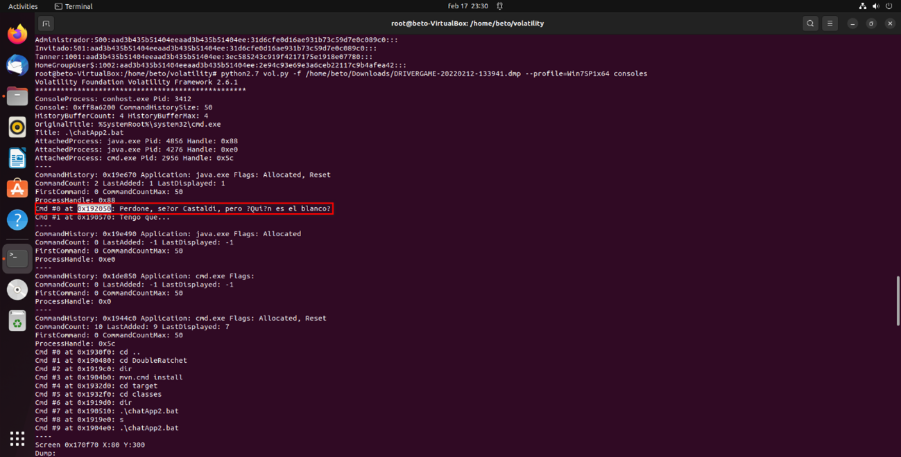

## 1.5 ¿Cómo se llama el archivo de proceso por lotes en el que se lanza la aplicación de chat?

   ``ChatApp2.bat``
   
   En este caso usaremos el comando cmdscan y encontramos nuestra aplicación de chat
   
   ``python2.7 vol.py -f /home/beto/Downloads/DRIVERGAME-20220212-133941.dmp --profile=Win7SP1x64 cmdscan``
   
   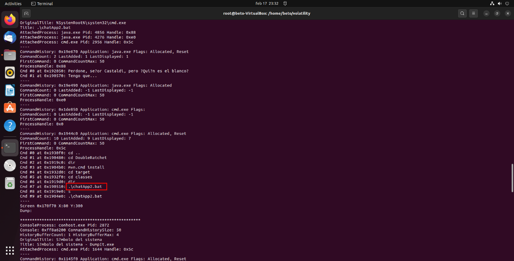

## 1.6 ¿Cuál es el identificador del proceso que tiene como hijo a una aplicación Java?

   ``Cmd.exe 	2956	Java.exe	4276	2956``
   
   Listamos los procesos con pstree y encontramos nuestro proceso padre e hijo
   
   ``python2.7 vol.py -f /home/beto/Downloads/DRIVERGAME-20220212-133941.dmp --profile=Win7SP1x64 pstree``
   
   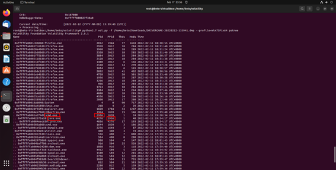

## 1.7 ¿Cuál es el apellido que Castaldi menciona durante la conversación en la que se revela que van a matar al Presidente?

   ``Maddox``
   
   Hacemos un dumpeo del proceso 3412 y luego lo analizamos con el siguiente comando:
   
   ``strings /home/beto/Desktop/3412.dmp -e l | grep "Castaldi" -A 20 -B 20``
   
   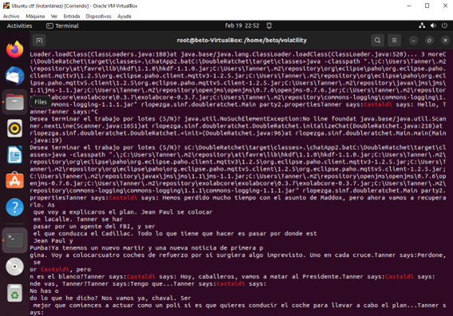

## 1.8 ¿Cuál es el nombre de archivo (incluida la extensión) con la imagen JPG que se abrió un rato antes de que Tanner tuviera que abandonar el equipo?

   ``driver_you_are_the_wheelman.jpg.ink``
   
   Volvemos a autopsy y vemos los Recent Documents asociados a nuestro usuario Tanner
   
   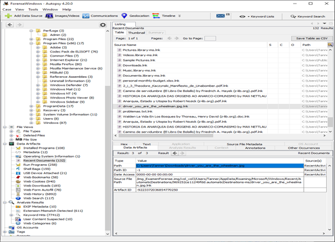

## 1.9 ¿Cuál es el identificador de proceso con el que abrió dicha imagen?

   ``2612``
    
   Repasando los procesos con pstree encontramos un proceso derivado de services.exe
   
  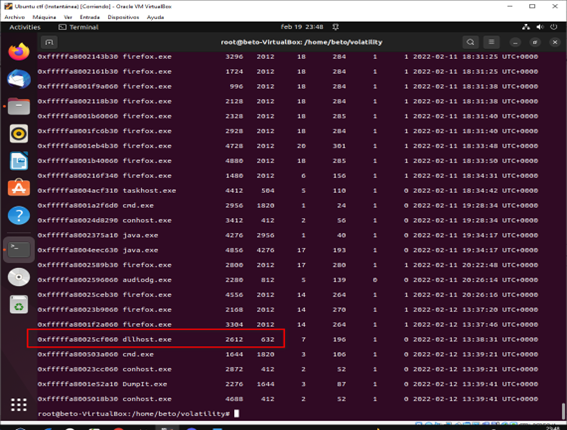

## 2.1 ¿Cuál es la versión del SO? (incluida la edición y el service pack si lo hubiera)
    
   ``Windows 7 Professional N Service Pack 1``
    
   Podríamos usar imageinfo de volatility en nuestra imagen pero desde autopsy ya nos dice la versión del sistema
   
   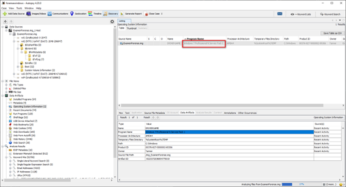

## 2.2 ¿En qué fecha y hora hizo Tanner login por última vez? (formato DD/MM/AAAA HH:mm:ss, poniendo la hora en la zona horaria UTC)

   ``13-02-2022 18:26:22 CET --- 13-02-2022 17:26:22 UTC``
   
   En el disco vol3 - users - Tanner podemos ver la ultima conexión en formato CET que deberemos atrasar una hora para ponerla en el formato correcto
   
   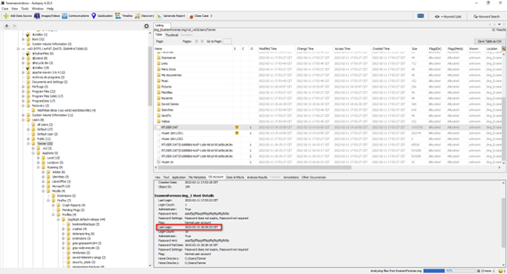

## 2.3 ¿En qué fecha y hora se equivocó por última vez Tanner al meter su contraseña de usuario?

   ``2022-02-13 18:06:36 CET``
   
   En OS Accounts y nuestro usuario Tanner vemos el último Password Fail Date
   
   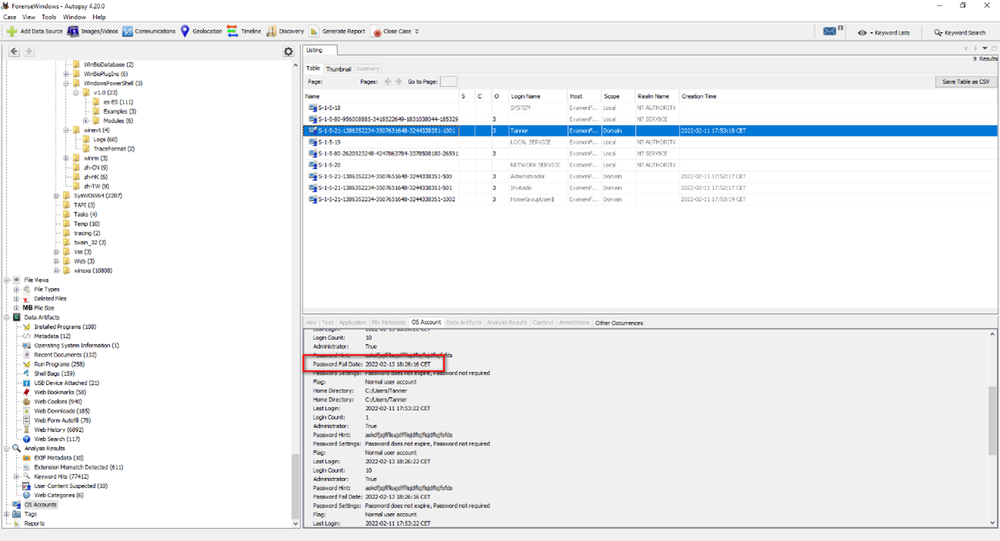

## 2.4 ¿Qué versión de Mozilla Firefox tenía Tanner instalado en su equipo? (Usar el formato major.minor, sin la letra “v” ni nada)

   ``App Version:97.0``
   
   Vol3/Program Files (x86)/Mozilla Firefox - en el archivo install.log encontramos la versión del navegador
   
   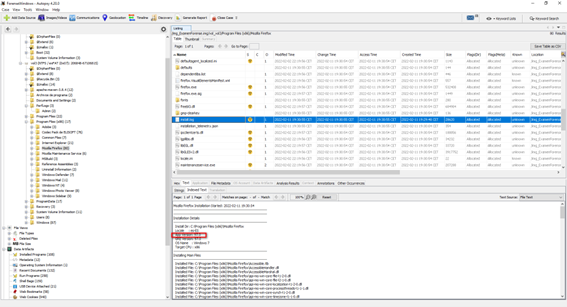

## 2.5 Tanner ha estado mirando un vídeo sobre un terrorista. ¿Cuál es su nombre?

   ``Thedore Kaczynski``
   
   En el Web History vemos las busquedas relacionadas con el terrorista y su biografía
   
   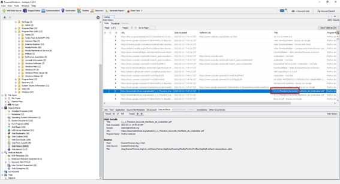

## 2.6 Sabemos que Tanner se aloja en el Holiday Inn Manhattan Financial District, pero los mafiosos han alojado a Jean Paul en otro hotel y nuestro héroe tiene que ir a recogerlo allí. ¿Cuál es?

   ``Hilton Garden Inn``

   También podemos ver las busquedas relacionadas con su hotel y el de jean paul
   
   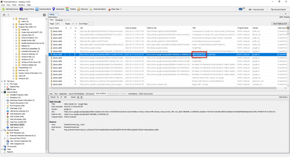

## 2.7 ¿En qué lugar estará Tanner de vacaciones probablemente?

   ``Cancún``
   
   De nuevo investigando las busquedas encontramos vacaciones en cancun
   
  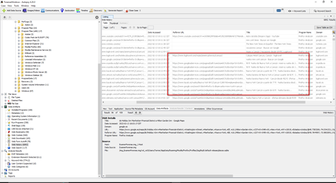
 
 
## 2.8 ¿En qué fecha y hora introdujo Tanner su pendrive por última vez en el equipo? (formato DD/MM/AAAA HH:mm:ss, poniendo la hora en la zona horaria CET)

   ``12/02/2022 14:39:17 CET``

   En USB Device Attached encontramos el pendrive
   
   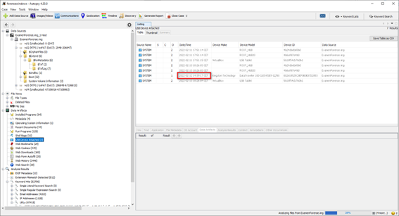

## 2.9 Tanner se descargó un libro en formato .doc ¿Cuál es el nombre completo del archivo?

   ``La Vida En Los Bosques by Thoreau, Henry David (z-lib.org).doc``
   
   En Recent Documents vemos que solo hay un libro en formato .doc
   
   
   
   
   
   

**Autor:** [AlbertoMiñan](https://github.com/albertominan)
