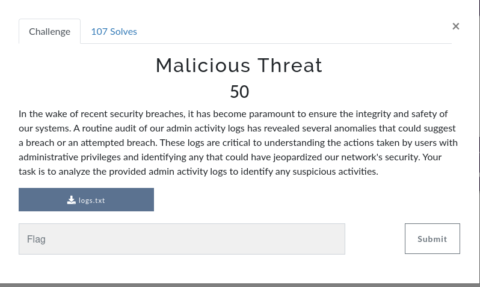
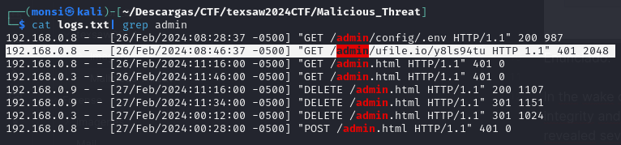
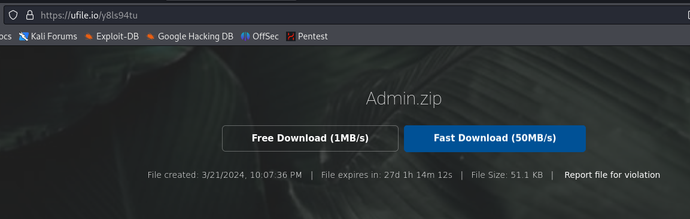
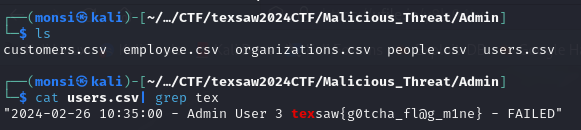

## Enunciado

Enunciado:

In the wake of recent security breaches, it has become paramount to ensure the integrity and safety of our systems. A routine audit of our admin activity logs has revealed several anomalies that could suggest a breach or an attempted breach. These logs are critical to understanding the actions taken by users with administrative privileges and identifying any that could have jeopardized our network's security. Your task is to analyze the provided admin activity logs to identify any suspicious activities.

Traducción:

A raíz de las recientes violaciones de seguridad, se ha vuelto primordial garantizar la integridad y seguridad de nuestros sistemas. Una auditoría de rutina de nuestros registros de actividad administrativa ha revelado varias anomalías que podrían sugerir una infracción o un intento de infracción. Estos registros son fundamentales para comprender las acciones realizadas por los usuarios con privilegios administrativos e identificar aquellas que podrían haber puesto en peligro la seguridad de nuestra red. Su tarea es analizar los registros de actividad del administrador proporcionados para identificar cualquier actividad sospechosa.
## Resolución

Buscando en el archivo logs.txt proporcionado encontramos varias peticiones, filtrando por admin obtenemos una especialmente llamativa.

Introduciendo esa dirección en el navegador observamos que es una página existente en ufile

Obtenemos varios archivos csv del .zip, después de buscar en ellos obtenemos finalmente la flag.

Autor: [Iago López](https://github.com/IagoLB)
