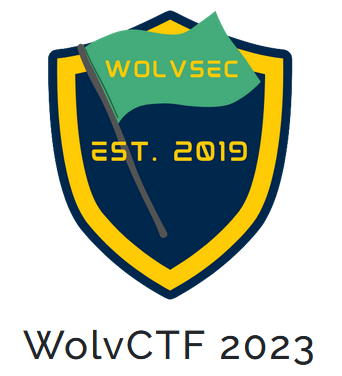
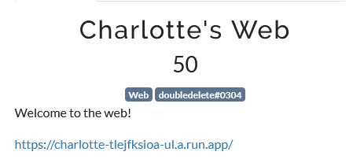
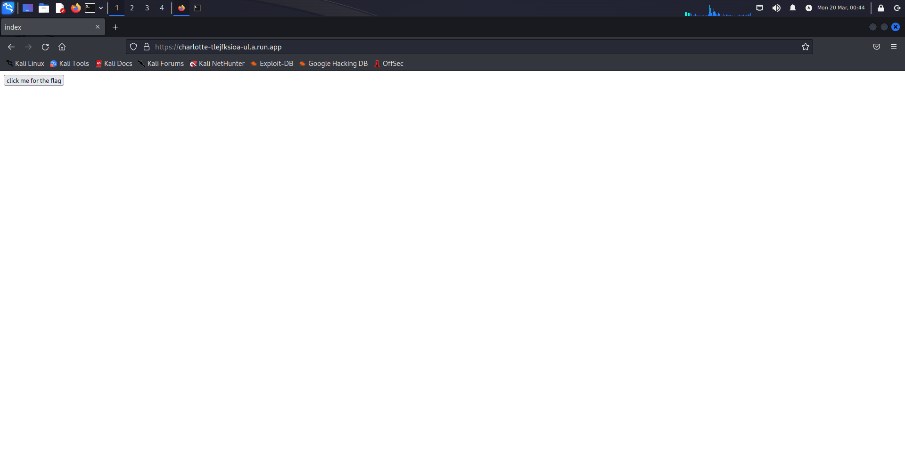
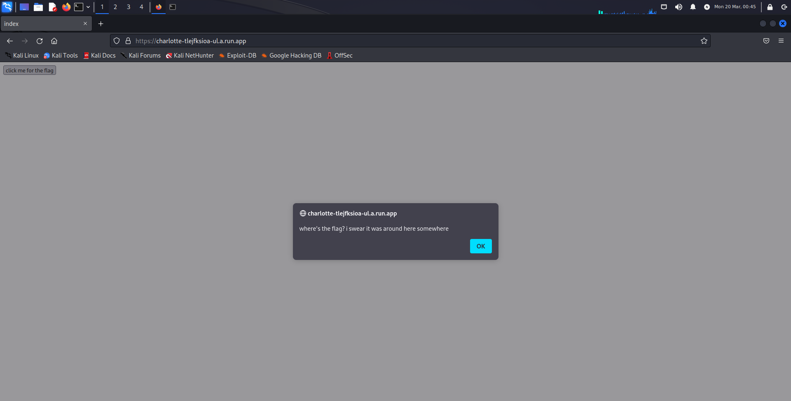
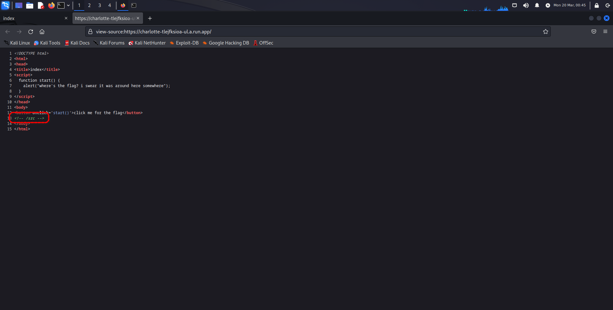
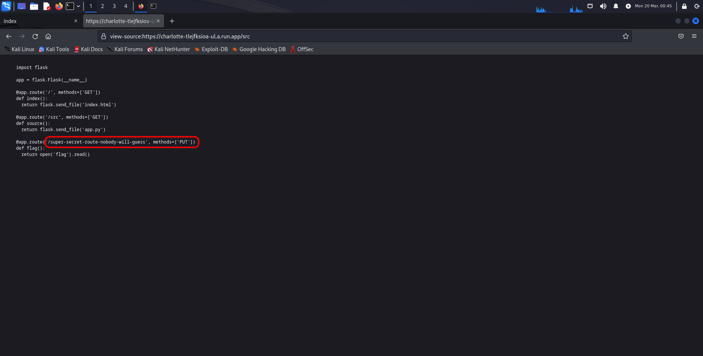
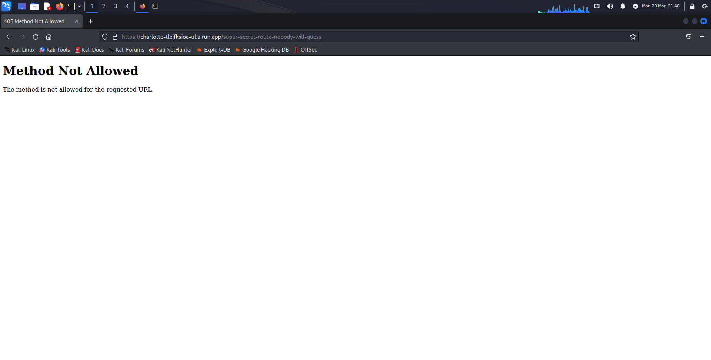
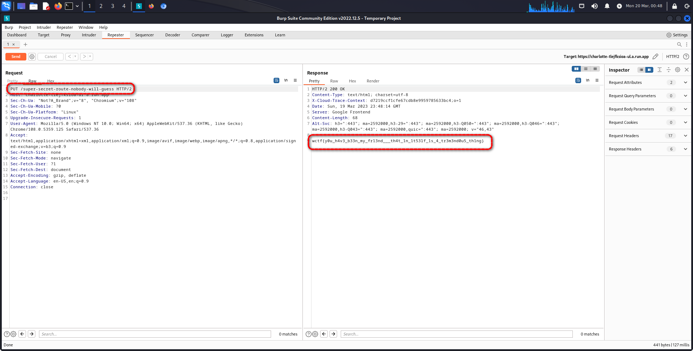

# WolvCTF 2023
    
  

  
## WEB

    

Esta vez se nos abre una página que contiene un botón.

### Solución
    
    ``wctf{y0u_h4v3_b33n_my_f13nd___th4t_1n_1t53lf_1s_4_tr3m3nd0u5_th1ng}``
   
  Investigaremos el funcionamiento de la página mirando el código fuente y usando burpsuite.

**Autor:** [AlbertoMiñan](https://github.com/albertominan)
