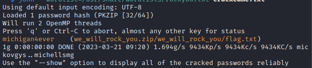

# Enunciado
*Hey! Here's the code for your free tickets to the rock concert! I just can't remember what I made the password...*

**Traducción:** "¡Hey! ¡Aquí está el código para tus entradas gratis al concierto de rock! Sólo que no puedo recordar que hice la contraseña..."

# Resolución

Se nos proporciona un fichero zip cifrado con contraseña. Vamos a usar John The Ripper y el diccionario Rockyou.txt para descifrarlo:

Ejecutamos zip2john para extraer el hash del archivo:

`zip2john we_will_rock_you.zip > hash.txt`

Ejecutamos John the Ripper con el diccionario Rockyou.txt y el archivo hash:

`john --wordlist=/usr/share/wordlists/rock`ou.txt hash.txt`

Y obtenemos la contraseña (michigan4ever):



Con la contraseña obtenida descomprimimos el zip y obtenemos el fichero flag.txt, dentro del cual está la flag


 
**Autor:** [Andr3sdelRio](https://twitter.com/Andr3sdelRio) 

<pre>
```python
def hello_world():
    print("Hello, World!")

hello_world()
```
</pre>
