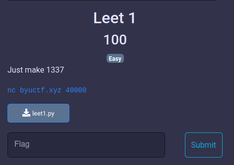
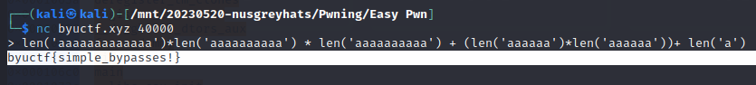

# Enunciado

# Resolución

El desafío nos proporcionó un script de Python que básicamente tomaba una entrada del usuario y verificaba dos condiciones:

    La entrada no debería contener ningún dígito.
    La evaluación de la entrada debería ser igual a 1337.

Si ambas condiciones se cumplían, se nos proporcionaría la bandera. El código del script de Python era el siguiente:

~~~
import re

FLAG = open('flag.txt').read()

inp = input('> ')

if re.search(r'\d', inp) or eval(inp) != 1337:
    print('Nope')
else:
    print(FLAG)
   
~~~

Lo que había que hacer era generar el número 1337 pero sin utilizar dígitos. Hay muchas formas de hacerlo, por ejemplo, con la siguiente expresión:
~~~
 len('aaaaaaaaaaaaa')*len('aaaaaaaaaa') * len('aaaaaaaaaa') + (len('aaaaaa')*len('aaaaaa'))+ len('a')
~~~
La introducimos y conseguimos la bandera:

 
**Autor:** [Andr3sdelRio](https://twitter.com/Andr3sdelRio) 
