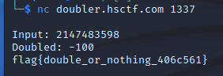

# Enunciado

# Resolución

El fichero chall.c contien el siguiente código:

~~~
#include <stdio.h>
#include <stdlib.h>

int main() {
	char flag[32];
	FILE* f = fopen("flag.txt", "r");
	if (f == NULL) {
		puts("flag.txt not found");
		return 1;
	}
	fgets(flag, 32, f);
	fclose(f);

	setvbuf(stdout, 0, 2, 0);
	setvbuf(stdin, 0, 2, 0);
	printf("Input: ");
	char buffer[16];
	fgets(buffer, 16, stdin);
	int val = atoi(buffer);
	if (val < 0) {
		puts("Error: no negative numbers allowed!");
		return 1;
	}
	int doubled = 2 * val;
	printf("Doubled: %i\n", doubled);
	if (doubled == -100) {
		puts(flag);
	}
}
~~~

Lo que vemos es que para obtener la flag, la variable *double* tiene que ser igual a -100, pero este valor lo debemos de obtener sin ingresar ningún valor negativo, ya que tenemos dicha comprobación en la entrada de datos. Por lotanto, la solución consistirá en introducir un número positivo lo suficientemente grande para que al multiplicarse por 2 se produzca un desbordamiento y resulte en el valor deseado de -100.

En una representación de enteros de 32 bits, el valor máximo que se puede almacenar en un int sería 2^31 - 1 (2147483647). Por lo que, al introducir 2147483648, se desbordará y se convertirá en -2147483648, y al multiplicarlo por 2, obtendremos 0, que es el valor cuando se reduce a módulo 2^32.

Según esto, el valor que buscamos será: 2147483598

 
**Autor:** [Andr3sdelRio](https://twitter.com/Andr3sdelRio) 

- [URL original del reto](https://ctf.hsctf.com/challs). *Disclaimer:Probablemente se encuentre offline poco después de finalizar la competición* 
 
