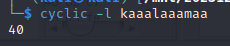
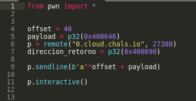

# Enunciado

Lo único que nos dan es una dirección de internet, un puerto y nos dan el binario que suponemos se está ejecutando allí.

Echamos un ojo, mediante `file`, al tipo de ejecutable y ejecutamos ``checksec` para ver las protecciones que tiene el binario. Vemos que no tiene protecciones de "Canarios de pila" ni PIE, por lo cual es vulnerable a ciertos tipos de buffers overflows:

Mediante `Ghidra`decompilamos el ejecutable y vemos que existe una función llamada `do_system()` que nos proporciona un shell en el sistema remoto, pero que no es llamada en ningún momneto por el flujo normal del programa.

Analizando con más detalle el código, vemos que la entrada de usuario se almacena en un array de caracteres de 32 bytes de largo. Por otro lado, se hace uso de la función `gets()`para capturar la entrada. Esta función no hace ninguna comprobación de límites, por lo que, si introducimos una cadena mayor a 32 caracteres es posible que consigamos un desbordamiento de buffer.

Vamos a utilizar el comando `cyclic` de `pwntools`para generar una cadena de caracteres con un patrón conocido. Lo exportamos a un fichero de texto.

A continuación, abrimos de nuevo el ejecutable con `gdb-gef`y ejecutamos el programa, *r* (run), pasándole el fichero con el patrón de caracteres generado. Com probamos efectivamente que hemos sido capaces de conseguir el desbordamiento de buffer y que hemos sido capaces de sobrescribir el registro `rsp` donde se almacena la dirección de retorno. Este es el registro que deberemos de sobrescribir con la dirección de memoria la función `do_system()` 

Primero buscamos cuantos caracteres tenemos que escribir para llegar a la posición del registro rsp. Como hemos podido ver el contenido del mismo una vez logrado el desbordamiento, buscamos la cadena mostrada en nuestro patrón. Obteniendo un offset de 40 caracteres.

- **Nota**.- Esto también lo podríamos haber logrado con la opción *create pattern* y *pattern search* de `gdb-gef`

A continuación, Vamos a abrir el ejecutable con ``gdb-gef` y buscar la dirección de memoria de la función `do_system()` :

Con todo ello ya podemos crear el código de nuestro exploit. Primero lo probamos con el ejecutable local:

Y vemos que tenemos éxito, consiguiendo una shell:

Modificamos ahora el código para poder ejecutarlo contra el servicio remoto:

Lo ejecutamos y conseguimos la Shell y la flag:

 
**Autor:** [Andr3sdelRio](https://twitter.com/Andr3sdelRio) 

- [URL original del reto](https://thecybercoopctf.ctfd.io/challenges#medbof-22)
 

