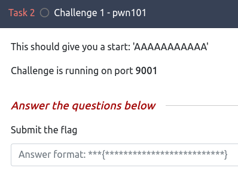
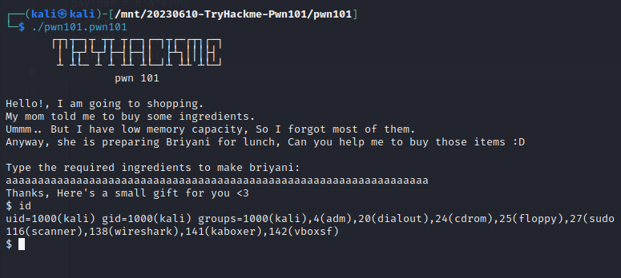
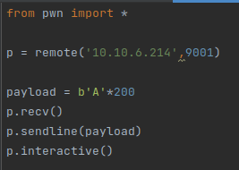
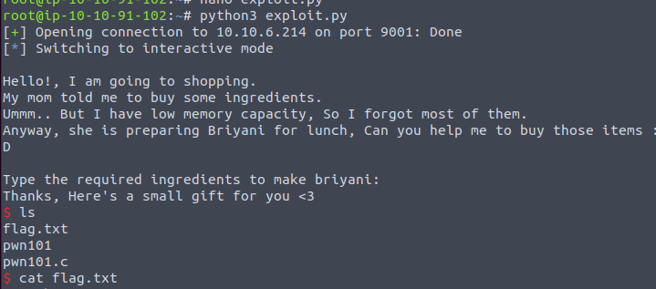

# Enunciado

# Resolución

Si utilizamos un decompilador, como *GHidra*, para examinar el ejecutable proporcionado, nos encontraremos con el siguiente código en la función principal (main):

~~~
void main(void)

{
  char local_48 [60];
  int local_c;
  
  local_c = 0x539;
  setup();
  banner();
  puts(
      "Hello!, I am going to shopping.\nMy mom told me to buy some ingredients.\nUmmm.. But I have l ow memory capacity, So I forgot most of them.\nAnyway, she is preparing Briyani for lunch, Can  you help me to buy those items :D\n"
      );
  puts("Type the required ingredients to make briyani: ");
  gets(local_48);
  if (local_c == 0x539) {
    puts("Nah bruh, you lied me :(\nShe did Tomato rice instead of briyani :/");
                    /* WARNING: Subroutine does not return */
    exit(0x539);
  }
  puts("Thanks, Here\'s a small gift for you <3");
  system("/bin/sh");
  return;
}
~~~
El problema principal en este código es el uso de la función `gets()`, que es notoriamente insegura y propensa a causar vulnerabilidades de desbordamiento de búfer (buffer overflow).

El código define un arreglo de caracteres `local_48` con un tamaño de 60 bytes. Luego, utiliza la función `gets()` para leer la entrada del usuario directamente en este arreglo. La función `gets()` no verifica el tamaño de la entrada, lo que significa que si un usuario ingresa más de 60 caracteres, estos datos adicionales se escribirán más allá del final del arreglo `local_48`. Esto puede sobrescribir otros datos en la pila, incluyendo el valor de la variable `local_c`, y potencialmente puede permitir la ejecución de código arbitrario o provocar un comportamiento inesperado del programa.

La condición `if (local_c == 0x539)` está diseñada para verificar si `local_c` aún contiene su valor original (1337 en decimal), pero debido a la vulnerabilidad mencionada, este valor puede ser fácilmente alterado por una entrada maliciosa y hacer que el programa no entre en el bucle y pase a ejecutar `system("/bin/sh")` que nos dará un shell en el entorno de ejecución del programa.

Al ejecutar el binario vemos que con una entrada grande ya se desborda y, efectivamente, nos da una shell.

Por lo que escribimos un código con ayuda de las pwntools para la ejecución contra el entorno remoto:

~~~
from pwn import *
p = remote('10.10.6.214',9001)

payload = b'A'*200
p.recv()
p.sendline(payload)
p.interactive()
~~~
Veamos cada parte del código:

1. **`from pwn import *`**: Esta línea importa la biblioteca `pwn`. Esta biblioteca contiene funciones y clases útiles para escribir exploits y scripts de pruebas de penetración.

2. **`p = remote('10.10.6.214',9001)`**: Esta línea crea un objeto remoto que representa una conexión de red a la dirección IP `10.10.6.214` en el puerto `9001`, donde se está ejecutando la aplicación que se quiere explotar.

3. **`payload = b'A'*200`**: Aquí se crea una cadena de bytes (`payload`) que consiste en 200 caracteres "A". La letra `b` antes de `'A' indica que la cadena `'A'*200` debe ser tratada como una cadena de bytes en lugar de una cadena de texto normal (string) en Python.

En Python, las cadenas de texto (strings) y las cadenas de bytes son dos tipos de datos diferentes:

1. **String**: Representa texto. En Python 3, los strings se almacenan internamente como secuencias de caracteres Unicode. Son utilizados para trabajar con texto (por ejemplo, caracteres alfabéticos, dígitos, símbolos).

2. **Byte String**: Representa datos binarios. Se especifican con un prefijo `b` y se usan para trabajar con datos a nivel de byte, lo cual es útil para operaciones a bajo nivel, como la comunicación de red, el manejo de archivos binarios, y la seguridad informática (como en tu ejemplo).

Al usar `b'A'*200`, estamos creando una secuencia de 200 bytes, donde cada byte es un `0x41` (el valor ASCII de la letra 'A'). Esto es útil en el contexto de pruebas de penetración y explotación de vulnerabilidades, como buffer overflows, donde es importante tratar los datos como bytes puros en lugar de texto porque es importante tener un control preciso sobre la representación exacta de los datos que estás enviando.

4. **`p.recv()`**: Esta línea recibe datos del servidor. Es común en la comunicación de red esperar a que el servidor envíe algún tipo de mensaje o indicador antes de enviar datos. Esta función espera y recibe esos datos pero no los asigna a ninguna variable, ya que en este caso el mensaje del servidor no es relevante para el propósito del script.

5. **`p.sendline(payload)`**: Envía el `payload` al servidor. La función `sendline` envía los datos y luego una nueva línea, lo cual es común en la comunicación basada en texto.

6. **`p.interactive()`**: Finalmente, esta línea cambia la interacción con el servidor a un modo interactivo, permitiendo al usuario enviar comandos manualmente después de que se haya enviado el `payload`.

Lo ejecutamos y podemos acceder a la flag.

## Nota 
En C, hay varias funciones consideradas problemáticas o inseguras, principalmente porque no realizan comprobaciones de límites en los datos que manejan. Esto puede llevar a vulnerabilidades como desbordamientos de búfer (buffer overflows), corrupción de memoria, y otros problemas de seguridad. Algunas de estas funciones incluyen:

1. **`gets()`**: Como ya se mencionó, no realiza ninguna verificación de límites en la entrada, lo que puede causar desbordamientos de búfer.

2. **`strcpy()` y `strcat()`**: Estas funciones copian y concatenan cadenas respectivamente, sin verificar el tamaño del búfer de destino. Pueden causar desbordamiento de búfer si la cadena de origen es más larga que el espacio disponible en el búfer de destino.

3. **`sprintf()`**: Similar a `strcpy()` y `strcat()`, `sprintf()` escribe datos formateados a una cadena sin comprobar si el búfer de destino es lo suficientemente grande para los datos, lo que puede llevar a desbordamientos de búfer.

4. **`scanf()`**: Sin especificadores de anchura adecuados, `scanf()` puede escribir más datos en un búfer de lo que puede sostener, lo que lleva a un desbordamiento de búfer. Esto es especialmente problemático con el especificador de formato `%s`.

5. **`strncpy()` y `strncat()`**: Aunque estas funciones están diseñadas para ser más seguras que `strcpy()` y `strcat()` al incluir un límite de tamaño, pueden ser problemáticas si no se usan correctamente. Por ejemplo, `strncpy()` no garantiza que la cadena de destino termine con un carácter nulo si el tamaño de la cadena de origen es igual o mayor que el límite de tamaño, lo que puede llevar a errores de cadenas no terminadas.

6. **`memcpy()` y `memmove()`**: Estas funciones copian bloques de memoria y también pueden causar desbordamientos de búfer si el búfer de destino no es lo suficientemente grande.

 
**Autor:** [Andr3sdelRio](https://twitter.com/Andr3sdelRio) 

- [URL original del reto](https://tryhackme.com/room/pwn101) 
 

