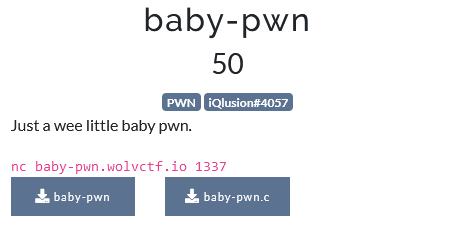
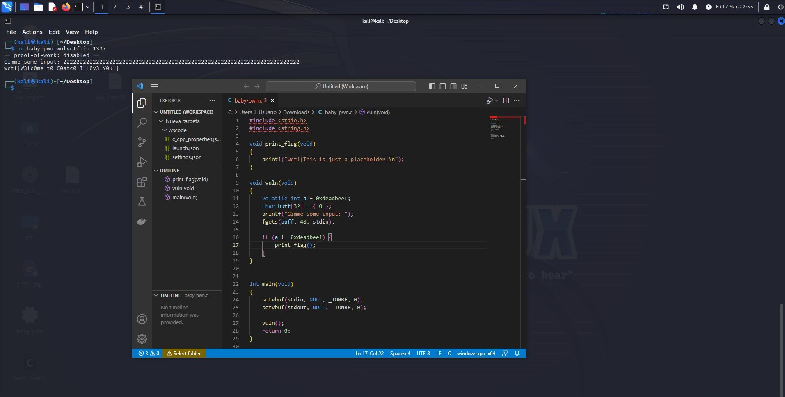

# WolvCTF 2023
    
  

 
 
## Baby-pwn

### Solución
    
    ``wctf{W3lc0me_t0_c0stc0_I_L0v3_Y0u!}``
   
  Analizando el código vemos que si le pasamos un input de 48 caracteres sucederá un  desbordamiento del buffer.

**Autor:** [AlbertoMiñan](https://github.com/albertominan)
