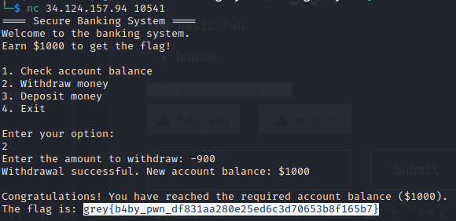

# Enunciado
Basic Pwn
~~~
nc 34.124.157.94 10541
~~~

# Resolución

Al conectarte al netcat, obtenemos la siguiente salida:

~~~
==== Secure Banking System ====
Welcome to the banking system.
Earn $1000 to get the flag!

1. Check account balance
2. Withdraw money
3. Deposit money
4. Exit

Enter your option:
~~~

El código es el siguiente:

~~~

#include <stdio.h>

int main()
{
    int accountBalance = 100, tmp;
    long int withdrawalAmount;
    short option;

    printf("==== Secure Banking System ====\n");
    printf("Welcome to the banking system.\nEarn $1000 to get the flag!\n\n");

    while (accountBalance < 1000)
    {

        printf("1. Check account balance\n");
        printf("2. Withdraw money\n");
        printf("3. Deposit money\n");
        printf("4. Exit\n\n");
        printf("Enter your option:\n");
        scanf("%hu", &option);

        switch (option)
        {
        case 1:
            printf("Your account balance is: $%d\n", accountBalance);
            break;
        case 2:
        {
            printf("Enter the amount to withdraw: ");
            scanf("%ld", &withdrawalAmount);
            tmp = accountBalance - withdrawalAmount;
            if (tmp < 0)
            {
                printf("You cannot withdraw more than your account balance.\n");
                continue;
            }
            accountBalance = tmp;

            printf("Withdrawal successful. New account balance: $%d\n", accountBalance);
            break;
        }
        case 3:
            printf("Deposit is still work in progress.\n");
            break;
        case 4:
            printf("Thank you for banking with us.\n");
            return 0;
        default:
        {
            printf("Invalid option.\n");
            break;
        }
        }
    }

    printf("\nCongratulations! You have reached the required account balance ($%d).\n", accountBalance);
    printf("The flag is: grey{fake_flag}\n");

    return 0;
}                   

~~~

En el programa que examinamos, hay un bucle while que continúa mientras el saldo de la cuenta (accountBalance) sea menor a 1000. Si miramos el código, veremos esto:

~~~
while (accountBalance < 1000)
{
    //...
    // La opción de retirar dinero está aquí
    //...
}

printf("\nCongratulations! You have reached the required account balance ($%d).\n", accountBalance);
printf("The flag is: grey{fake_flag}\n");
~~~

Lo que podemos observar aquí es que el bucle while solo se rompe, y por lo tanto el programa avanza hacia las líneas de código que muestran la "flag", cuando *accountBalance* alcanza o supera los $1000.

Pero este programa tiene una vulnerabilidad de entero con signo. La vulnerabilidad se encuentra en la sección 2 de retirar dinero. Aquí, la cantidad a retirar se lee como un *long int*, que es un número de 64 bits en la mayoría de los sistemas modernos, pero la cuenta bancaria se almacena como un *int*, que es un número de 32 bits. Si intentamos retirar una cantidad de dinero que excede los límites de un int con signo pero no los de un long int con signo, podría provocarse un desbordamiento de entero. El programa tiene una comprobación para evitar que se retire más dinero del que tienes, pero esta comprobación puede ser eludida mediante dicho desbordamiento.

Se puede introducir un número negativo cuando pida cuánto dinero se desea retirar. Debido a que los enteros están firmados (signed) en este programa, si ingresas un número negativo, el programa lo sumará a tu saldo actual en lugar de restarlo, lo que aumentará el saldo. En una situación normal, retirar dinero de la cuenta reduciría el saldo de la cuenta. Sin embargo, debido a un problema en el código, pudemos "retirar" una cantidad negativa. Esto, paradójicamente, aumenta el saldo de la cuenta.

Cuando decidimos "retirar" -900, el código interpreta esto como si estuviéramos restando -900 del saldo de la cuenta. En otras palabras, el código realiza la operación accountBalance = accountBalance - (-900), que es lo mismo que accountBalance = accountBalance + 900. Dado que el saldo original en la cuenta era de 100, después de esta operación, el saldo de la cuenta se convierte en 1000. Ya que *accountBalance* es ahora igual a 1000, el bucle while se rompe y el programa procede a mostrar la "flag".

Aquí está la secuencia de pasos para obtener la flag:

    Inicia el programa.
    Selecciona la opción 2 para retirar dinero.
    Cuando pida ingresar la cantidad a retirar, ingresamos un número negativo, como -900.
    El programa sumará esta cantidad al saldo, lo que te llevará a un saldo de 1000.
    A continuación, el programa mostrará la flag.

 
**Autor:** [Andr3sdelRio](https://twitter.com/Andr3sdelRio) 
 
