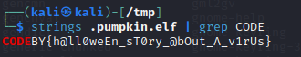

# Enunciado

### Ficheros
- [Fichero](https://drive.google.com/file/d/1CYJ_LFFqTiXl2XDbH-TxU46wSAF4vTDj/view?usp=sharing)

# Resolución

Lo primero es echar un vistazo al tipo de fichero y hacerle un *strings* por si aparecen cadenas de texto que nos puedan dar una pista:

Se trata de un fichero ejecutable, por lo que procedemos a su ejecución.  
Lo único que parece hacer es sacar un mensaje por pantalla y acabar su ejecución:

Lo siguiente que vamos a hacer es usar **GHidra** para decompilar el fichero ejecutable.  
Lo ejecutamos desde linea de comandos y creamos un nuevo proyecto:

Importamos el fichero que queremos decompilar:

Y le damos a la opción *Code browser* (Icono del dragón).  
Después de navegar por algunas de las funciones (*Symbol Tree->Functions*), encontramos la función que imprime el mensaje en pantalla. Y, si observamos más abajo, nos llama la atención una función que parece escribir en un fichero ubicado en la carpeta `/tmp` del sistema.

Si buscamos dicho fichero y le hacemos un *strings*, finalmente encontramos la flag:

 
**Autor:** [Andr3sdelRio](https://twitter.com/Andr3sdelRio) 

 

