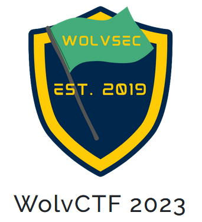
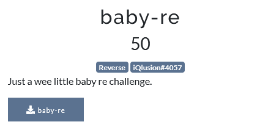
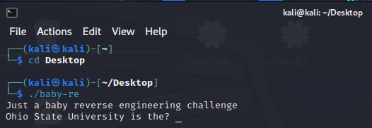
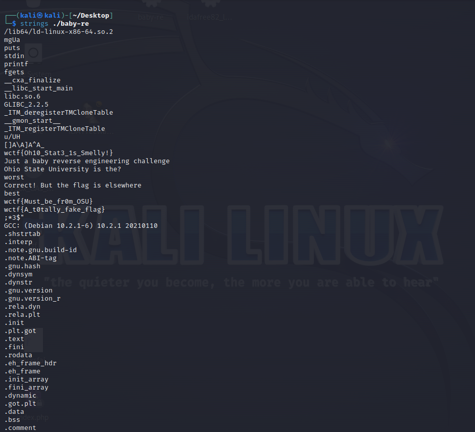
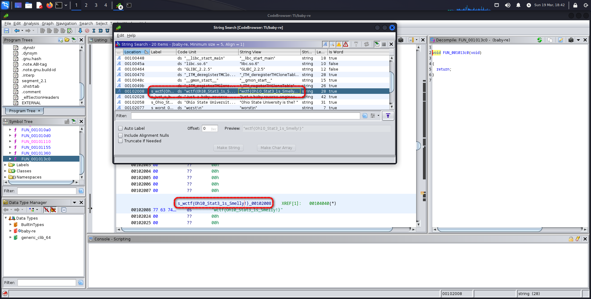

# WolvCTF 2023
    
  

  
## Baby-re

    

El programa nos hace una pregunta la cual la compara con la entrada correcta para darnos la flag.

### Solución
    
    ``wctf{Oh10_Stat3_1s_Smelly!}``
   
  Podemos ver en los strings del ejecutable y en el análisis dinámico la flag.

**Autor:** [AlbertoMiñan](https://github.com/albertominan)
