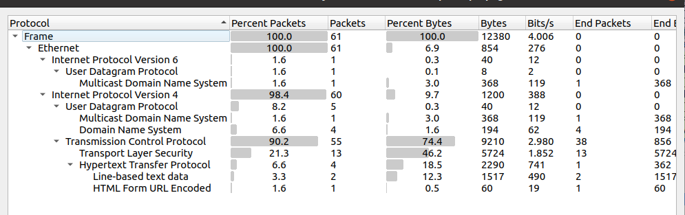
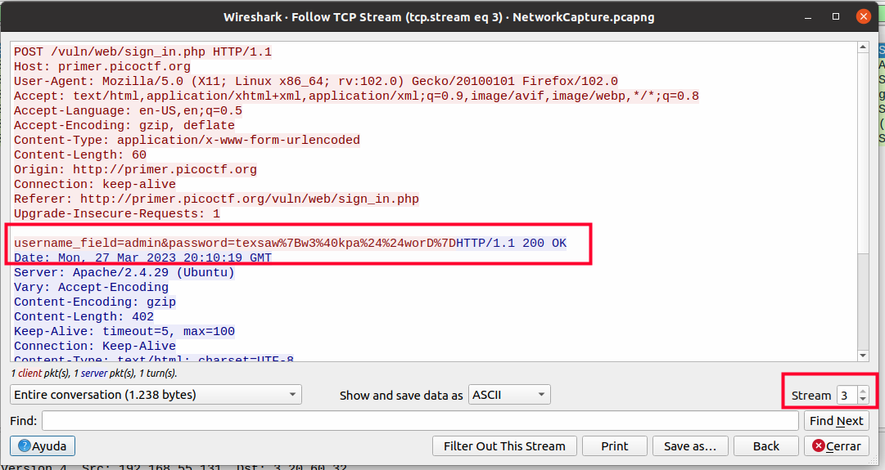
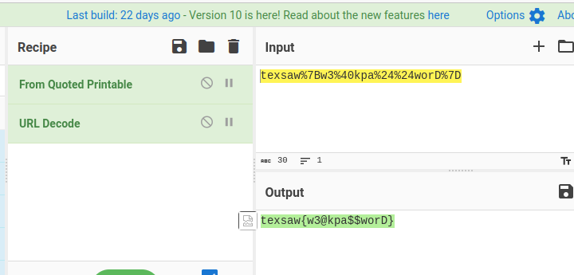

# Enunciado
*Find the hidden flag in the packet capture.*

**Traducción:** "Encuentra la bandera oculta en la captura de paquetes."

# Resolución

Abriendo el fichero con WireShark vamos a *Statistics -> Protocol Hierarchy* para hacernos una idea de lo que hay capturado

Vemos que hay una comunicación HTTP. Hacemos clic en uno de los paquetes con protoclo HTTP y hacemos clic en el botón derecho en *Follow TCP Stream*. Vamos incrementando el Stream (abajo a la derecha) y pronto encontramos lo siguiente:

Pasamos el texto de la contraseña, *texsaw%7Bw3%40kpa%24%24worD%7D*,  por CyberChef para que lo decodifique. La codificación utilizada en la contraseña es URL Encoding (también conocida como Percent Encoding o URL Escape Encoding).

Esta codificación se utiliza para convertir caracteres especiales y otros caracteres no seguros en una URL en una forma segura para la transmisión a través de internet. En este caso, los caracteres especiales de la contraseña como {, }, @, $, y " se han codificado utilizando la notación %XX, donde XX es el valor hexadecimal del carácter en la tabla ASCII.

Por ejemplo, %7B se refiere al carácter {, y %40 se refiere al carácter @. El signo de porcentaje % se utiliza como carácter de escape para indicar que el siguiente par de dígitos representa el valor hexadecimal de un carácter especial.

 
**Autor:** [Andr3sdelRio](https://twitter.com/Andr3sdelRio) 
 
