# Enunciado
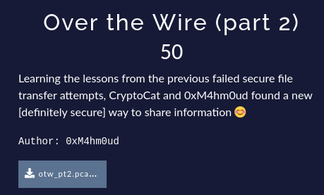

### Ficheros
- [Fichero](https://drive.google.com/file/d/1gKZmjLc-1AxPU8GlYmm_yg7eBLI8POcz/view?usp=sharing](https://drive.google.com/file/d/13KP6-moMwn-5xzDisbVDoJqeNKEsY99N/view?usp=sharing)

# Resolución

Lo primero que hacemos es echar un vistazo a la jerarquía de protocolos para conocer el tipo de tráfico que tenemos en la captura:

 *Statistics->Protocol Hierarchy*:

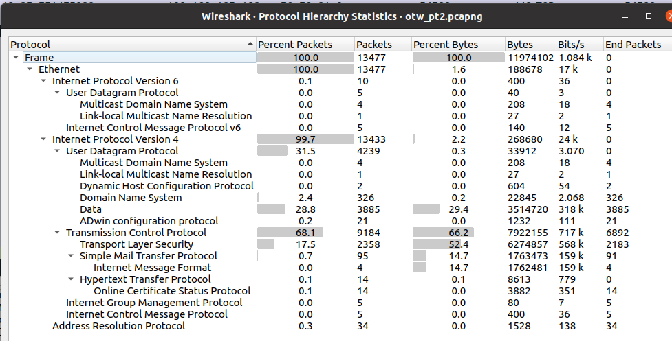

No parece que haya nada extraño. Lo siguiente que haremos será ver si podemos extraer algún fichero directamente mediante la opción *File->Export Objects-> HTTP* de Wireshark:

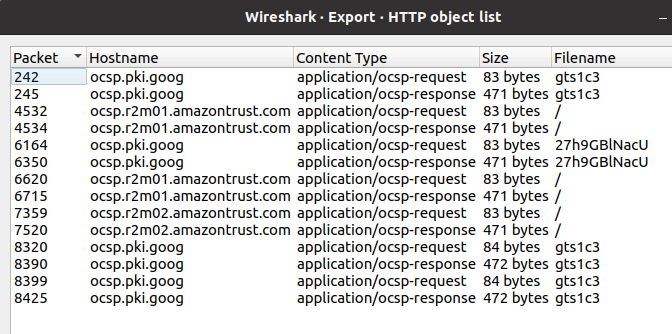

Nada destacable.Recorreremos ahora las distintas "conversaciones" o flujos de tráfico de la captura, mediante la opción *Analyze->Follow->TCP Stream (Ctrl+Alt+Shift+T)*.  
Iremos aumentando el Stream (esquina inferior derecha) para ver si encontramos algo interesante.  
En el Stream 19, encontramos el siguiente correo que hace mención a la necesidad de ocultar información a través del correo pero teniendo en cuenta que SMTP no es un protocolo seguro:

  
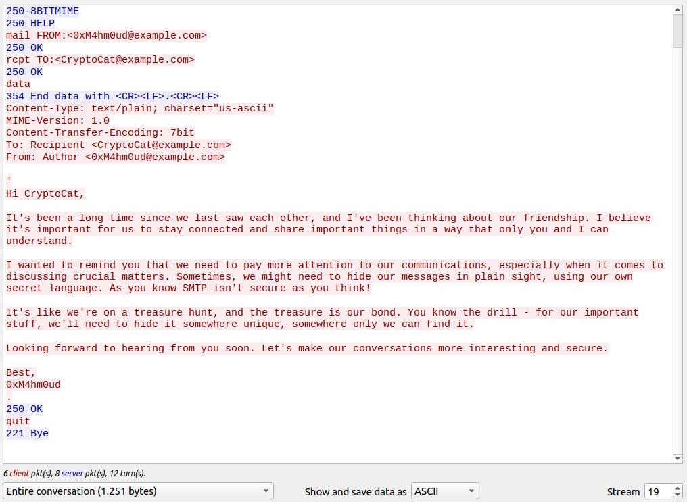

En el siguiente Stream nos encontramos otro correo que sigue en la misma línea que el anterior.

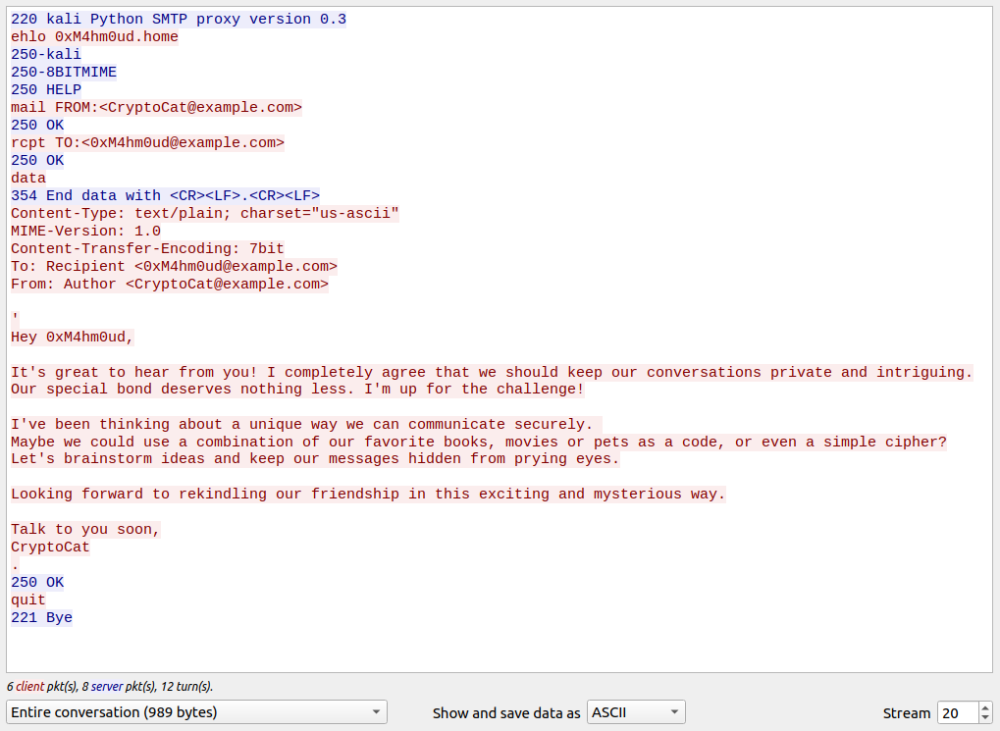

Seguimos avanzando y en el Stream 114 nos encontramos con un correo con un fichero adjunto codificado en Base64:

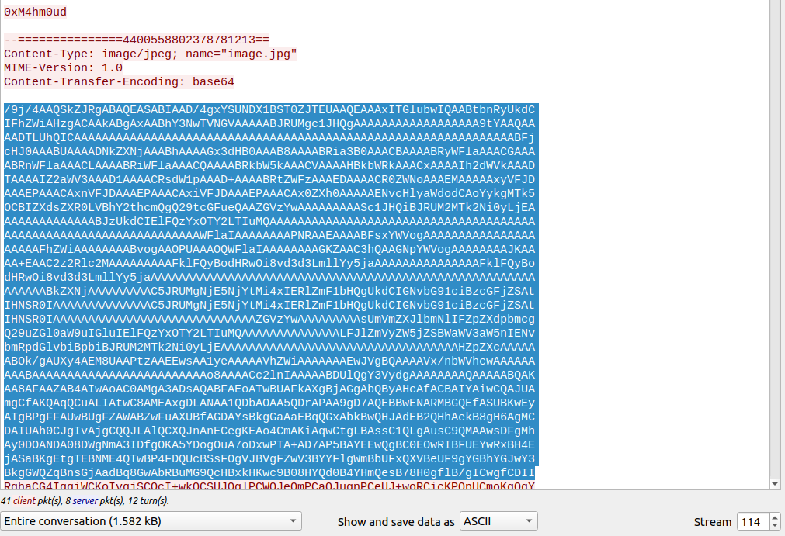

Copiamos todo el adjunto y lo pegamos en CyberChef. Utilizamos el módulo de decodificación en Base64 y luego dejamos que la varita haga su magia identificando el tipo de dato y mostrándonoslo con el visor adecuado.  
Vemos que se trata de una imagen por lo que procedemos a guardarla en un fichero:

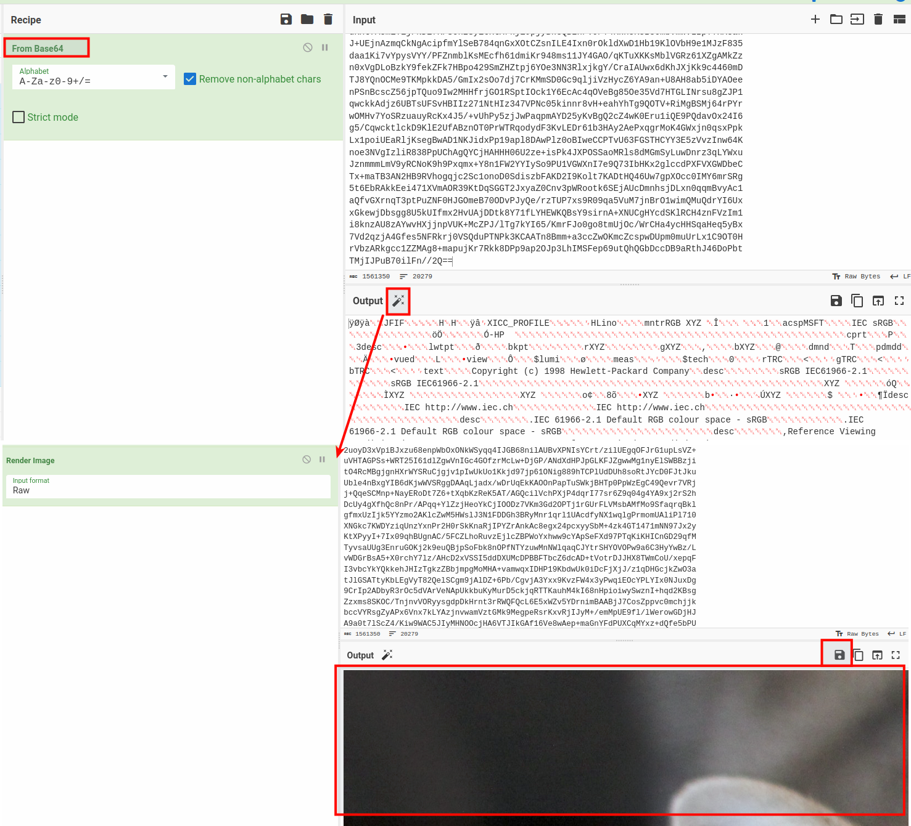

Al analizar los metadatos de la imagen con *exiftool*, observamos un comentario pero que no nos da mucha más información:

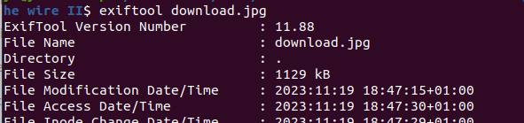
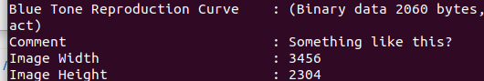

Seguimos investigando los flujos TCP y llegamos a otro fichero adjunto que también parece una imagen:

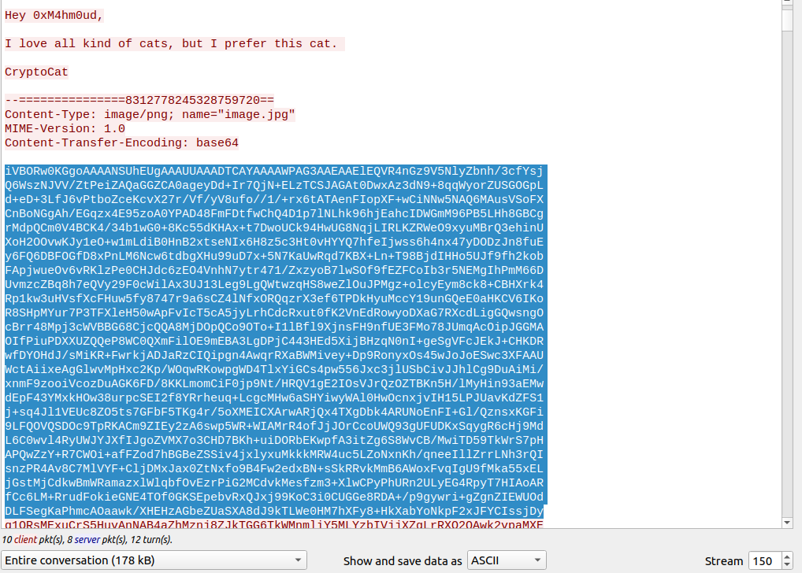

Repetimos el procedimiento con CyberChef y descargamos un nuevo fichero de imagen:

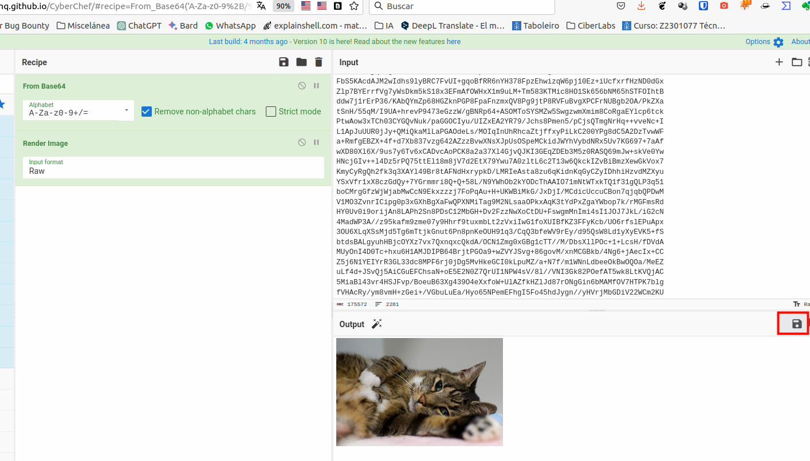

Miramos los metadatos de la nueva imagen con *exiftool* pero no obtenemos nada.  
Después de probar con diferentes técnicas y herramientas esteganográficas subimos la imagen a [Stegonline](https://stegonline.georgeom.net). 
La opción *Data Extract* nos permite aplicar técnicas LSB (Least Significant Bit) y MSB (Most Significant Bit) con los bits de la imagen. Después de probar unas pocas combinaciones, obtenemos el texto que buscamos:

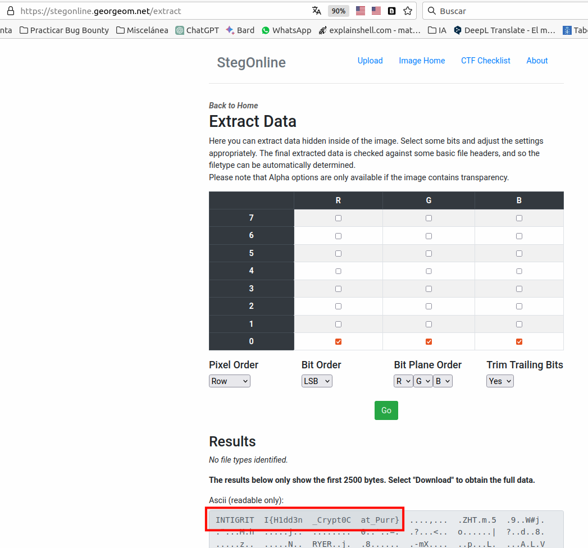

 
**Autor:** [Andr3sdelRio](https://twitter.com/Andr3sdelRio) 

 

