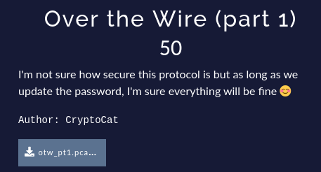
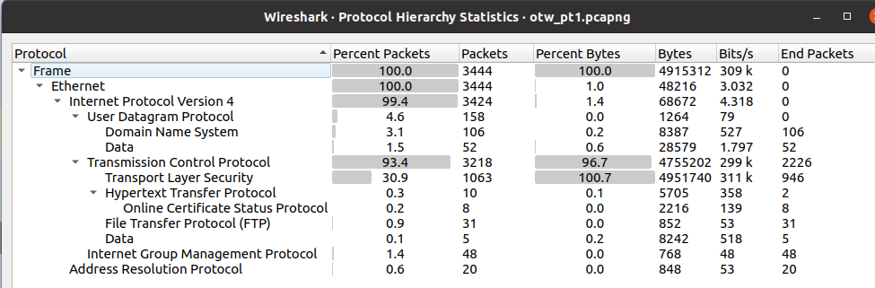
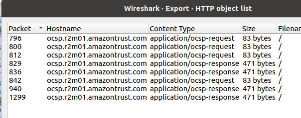
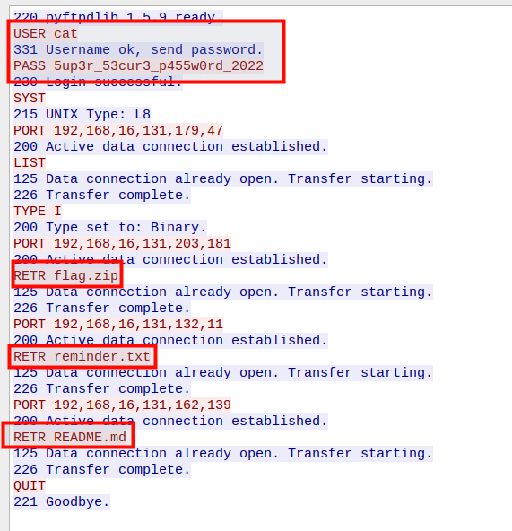
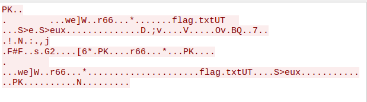
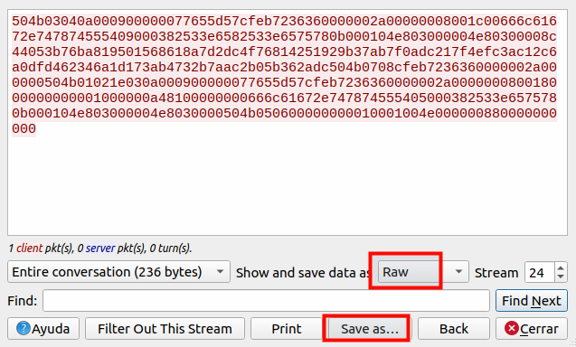
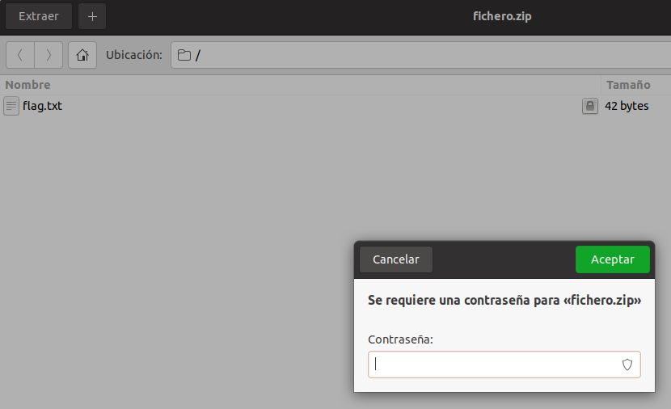
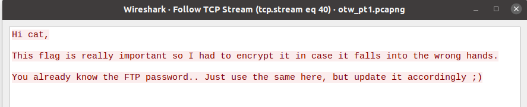

# Enunciado

# Resolución

Lo primero que hacemos es echar un vistazo a la jerarquía de protocolos para conocer el tipo de tráfico que tenemos en la captura:

 *Statistics->Protocol Hierarchy*:

No parece que haya nada extraño. Lo siguiente que haremos será ver si podemos extraer algún fichero directamente mediante la opción *File->Export Objects-> HTTP* de Wireshark:

Nada destacable.Recorreremos ahora las distintas "conversaciones" o flujos de tráfico de la captura, mediante la opción *Analyze->Follow->TCP Stream (Ctrl+Alt+Shift+T)*.  
Iremos aumentando el Stream (esquina inferior derecha) para ver si encontramos algo interesante.  
En el Stream 8, encontramos tráfico FTP con algunos datos interesantes:

  

Seguimos avanzando y en el Stream 24 encontramos lo que podría ser un fichero zip (posiblemente el intercambiado en la comunicación FTP). Lo identificamos por los caracteres de inicio "PK", que se corresponde con el inicio del [Magic Byte](https://en.wikipedia.org/wiki/List_of_file_signatures)  de los ficheros `zip` (50 4b en Hexadecimal)

Lo ponemos en formato crudo (RAW) y lo guardamos en un fichero:

Al acceder a su contenido, vemos que contiene dentro un fichero de nombre **flag.txt**, pero al querer descomprimirlo nos pide una contraseña:

De momento no sabemos nada de dicha contraseña por lo que seguimos avanzando en los flujos TCP y al llegar al Stream 40, obtenemos el siguiente texto:

Sabemos que la contraseña del servidor FTP es ` 5up3r_53cur3_p455w0rd_2022`, pero no parece ser la correcta ya que no nos descomprime el fichero. Miramos con más atención el mensaje y vemos que hace mención a que hay que actualizarla adecuadamente "*Just use the same here, but update it accordingly ;)*", por lo que actualizamos el año de la contraseña: ` 5up3r_53cur3_p455w0rd_2023`.

Y ahora sí que podemos descomprimir el fichero y acceder a su contenido:

` INTIGRITI{1f_0nly_7h3r3_w45_4_53cur3_FTP}`

 
**Autor:** [Andr3sdelRio](https://twitter.com/Andr3sdelRio) 

 

