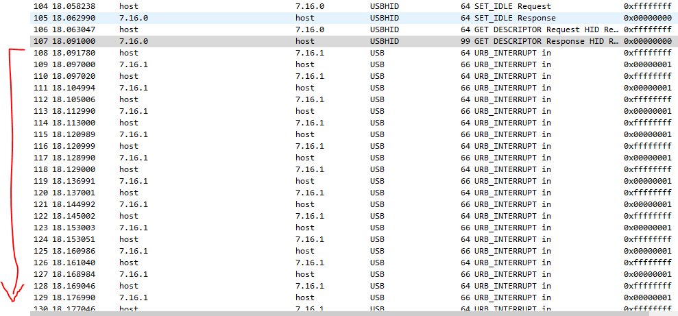
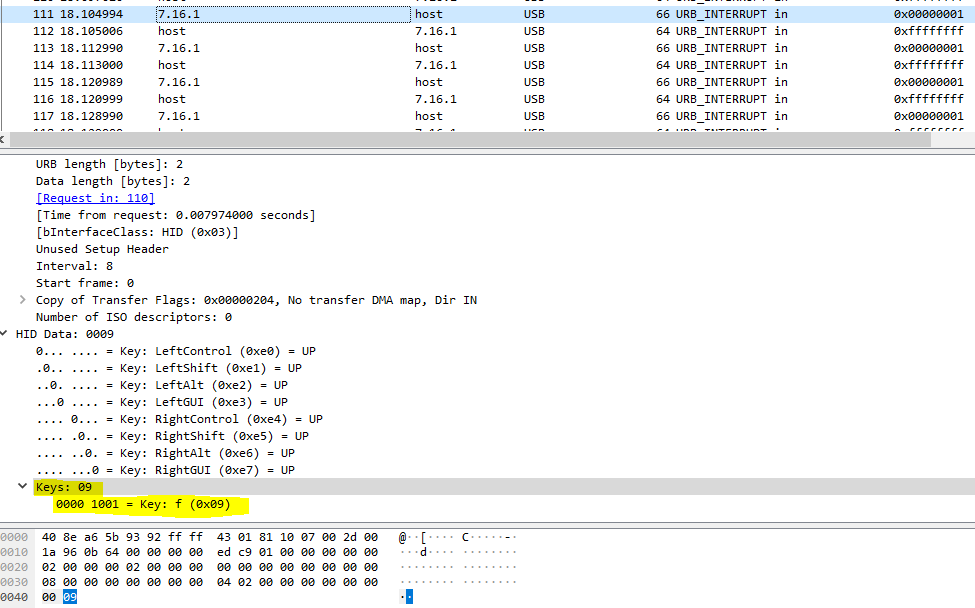

# Enunciado
*You Are Working As Digital Forensics Expert At Infosys India And Someone Reported That A PC Might Have Been Infected. Tech Team Already Collected All The Evidences From Workstation And Found That Someone Injected Malicious Code. It Is Your Job To Find, what Is Injected Into That PC.*

**Traducción:** "Está trabajando como experto forense digital en Infosys India y alguien ha informado de que un PC podría haber sido infectado. El Equipo Técnico Ya Ha Recogido Todas Las Pruebas De La Estación De Trabajo Y Ha Descubierto Que Alguien Ha Inyectado Un Código Malicioso. Es Su Trabajo Encontrar Lo Que Se Inyectó En Ese PC."

# Resolución

Se facilita una captura de tráfico entre un host y un dispositivo USB (USB PROTOCOL). 

Tras buscar información de cómo funciona el intercambio de información de este protocolo:
[https://www.usb.org/sites/default/files/documents/hut1_12v2.pdf](https://www.usb.org/sites/default/files/documents/hut1_12v2.pdf)
Vemos que una vez establecido el canal de comunicación comienza una “conversación” de longitudes de paquetes muy similares.

En algunos de estos paquetes no se muestran datos en el campo keys.

Ahora solo tenemos que hacer clic derecho en cualquiera de los paquetes no ignorados e ir a *Follow -> UDP Stream:*

Ahora solo tenemos que hacer clic derecho en cualquiera de los paquetes no ignorados e ir a *Follow -> UDP Stream:*

Ahora solo tenemos que hacer clic derecho en cualquiera de los paquetes no ignorados e ir a *Follow -> UDP Stream:*

Ahora solo tenemos que hacer clic derecho en cualquiera de los paquetes no ignorados e ir a *Follow -> UDP Stream:*

Ahora solo tenemos que hacer clic derecho en cualquiera de los paquetes no ignorados e ir a *Follow -> UDP Stream:*

